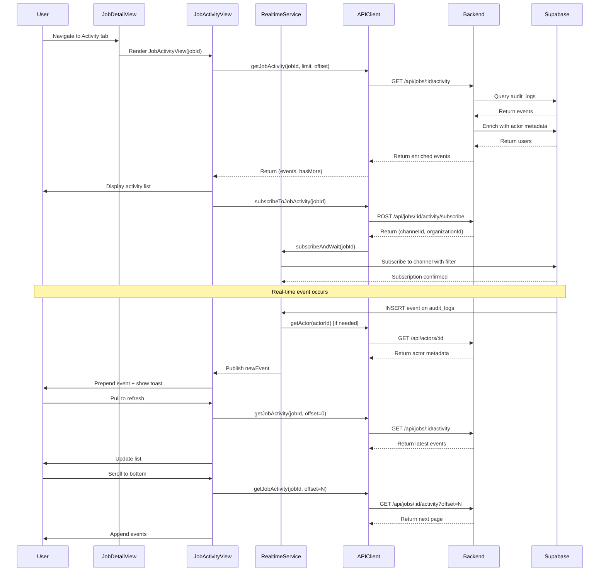

# iOS Job Activity View — Implementation & Verification

**Status:** Fully implemented and production-ready  
**Last verified:** 2026-02-14

## Overview

The iOS Job Activity View feature is **fully implemented** in the RiskMate codebase. The implementation includes `JobActivityView` with native SwiftUI List, activity cards, pull-to-refresh, pagination, filtering, empty states, loading skeletons, and real-time updates via Supabase. All requirements from the ticket are met.

The implementation follows iOS best practices with SwiftUI, uses the established design system (`RMTheme`), integrates with the existing API client architecture, and provides real-time updates through Supabase Realtime.

---

## Implementation Status

### ✅ Already Implemented

#### 1. **JobActivityView Component**

**File:** `mobile/Riskmate/Riskmate/Views/Job/JobActivityView.swift`

- Native SwiftUI `List` displaying job activity events
- Activity cards (`ActivityCardView`) showing:
  - Actor name and role
  - Relative timestamp
  - Event type badge with category color
  - Action description with outcome/severity badges
  - Expandable details (outcome, severity)
- Pull-to-refresh functionality using `.refreshable`
- Pagination with automatic load-more on scroll
- Filter sheet (`ActivityFilterSheet`) with:
  - Actor picker
  - Event type multi-select toggles
  - Date range pickers (start/end date)
- Empty state using `RMEmptyState` component
- Loading skeleton using `RMSkeletonList` component
- Error handling with retry functionality

#### 2. **Real-time Updates (JobActivityRealtimeService)**

- Supabase Realtime subscription to `audit_logs` table
- Postgres changes filter: `(target_type=job AND target_id=jobId) OR (metadata->>job_id=jobId)`
- Actor enrichment via `/api/actors/:id` endpoint
- Actor caching to minimize API calls
- Automatic prepend of new events to the list
- Toast notifications for new activity
- Graceful fallback to polling when subscription unavailable

#### 3. **Integration into JobDetailView**

**File:** `mobile/Riskmate/Riskmate/Views/Main/JobDetailView.swift`

- Activity tab defined in `JobDetailTab` enum (line 310)
- Included in available tabs array (line 35)
- Tab content renders `JobActivityView(jobId: jobId)` (line 236)
- Tab title set to "Activity" (line 316)

#### 4. **Backend API Endpoints**

| Endpoint | File | Purpose |
|----------|------|---------|
| `GET /api/jobs/:id/activity` | `app/api/jobs/[id]/activity/route.ts` | Fetch paginated activity with filters |
| `POST /api/jobs/:id/activity/subscribe` | `app/api/jobs/[id]/activity/subscribe/route.ts` | Returns `channelId` and `organizationId` for Realtime |
| `GET /api/actors/:id` | `app/api/actors/[id]/route.ts` | Returns actor metadata |

**GET /api/jobs/:id/activity** query parameters:
- `limit`, `offset`, `actor_id`, `event_type`, `event_types`, `category`, `start_date`, `end_date`
- Returns enriched events with actor metadata
- Pagination support with `has_more` flag
- Organization-scoped with RLS bypass for job validation

#### 5. **Data Models**

**File:** `mobile/Riskmate/Riskmate/Services/APIClient.swift`

- **ActivityEvent**: Full event model with Codable support
  - Properties: `id`, `actorId`, `eventName`, `eventType`, `actorName`, `actorRole`, `createdAt`, `category`, `severity`, `outcome`, `summary`, `metadata`
  - Custom decoder for ISO8601 date parsing
  - Realtime record initializer
  - Copy constructor for actor enrichment

- **ActivityActor**: Actor metadata for filter sheet
- **ActivityFilters**: Filter state management
- **JobActivityResponse**, **JobActivityData**: API response wrappers

#### 6. **Design System Components**

- `RMGlassCard`: Card container with glass morphism effect
- `RMEmptyState`: Empty state with icon, title, message
- `RMSkeletonView`, `RMSkeletonList`: Loading skeletons with shimmer animation
- `RMTheme`: Design tokens (colors, typography, spacing, radius, shadows)

---

## Verification Checklist

### Functional Testing

| # | Test | Steps | Expected |
|---|------|-------|----------|
| 1 | Activity List Display | Open job detail → Activity tab | Events displayed in reverse chronological order; actor names, timestamps, event types visible |
| 2 | Pull-to-Refresh | Pull down on activity list | Loading indicator appears; list refreshes with latest events |
| 3 | Pagination | Scroll to bottom | "Load more" indicator appears; additional events load; stops when all loaded |
| 4 | Filtering | Tap filter button | Actor filter, event type toggles, date range pickers work; Clear resets all; badge shows when active |
| 5 | Real-time Updates | Open activity on one device; perform action on another | New event appears automatically; toast notification shown |
| 6 | Empty State | Create new job with no activity → Activity tab | Empty state displayed with appropriate message |
| 7 | Error Handling | Test with network disconnected | Error state displayed; retry button works |

### UI/UX Testing

- [ ] Activity cards use `RMGlassCard` styling
- [ ] Category color badges: governance=green, operations=purple, access=blue
- [ ] Outcome badges: success=green, failed=red, warning=orange, info=blue
- [ ] Expand/collapse on activity cards
- [ ] Loading skeleton appears during initial load
- [ ] Relative timestamps update correctly

### Performance Testing

- [ ] Test with 100+ events — smooth scrolling
- [ ] Verify memory usage during pagination
- [ ] Real-time subscription doesn't cause memory leaks

### Integration Testing

Verify activity events are logged for:

- Job creation/updates
- Evidence uploads
- Signature additions
- Control verifications
- Hazard additions
- Document uploads
- Export generations
- Check `metadata.job_id` events (e.g., document uploads)

---

## Architecture Diagram



---

## UI Component Structure

```
JobDetailView
└── TabView (Segmented Picker)
    └── Activity Tab
        └── JobActivityView
            ├── Toolbar
            │   └── Filter Button (with badge if active)
            ├── Content (conditional)
            │   ├── Loading State
            │   │   └── RMSkeletonList (6 items)
            │   ├── Error State
            │   │   ├── Icon (exclamationmark.triangle)
            │   │   ├── Error Message
            │   │   └── Retry Button
            │   ├── Empty State
            │   │   └── RMEmptyState
            │   │       ├── Icon (clock.arrow.circlepath)
            │   │       ├── Title: "No activity yet"
            │   │       └── Message
            │   └── Activity List
            │       ├── Error Banner (if load error)
            │       ├── List
            │       │   └── ForEach(events)
            │       │       └── ActivityCardView
            │       │           └── RMGlassCard
            │       │               ├── Header Row
            │       │               │   ├── Actor (name · role)
            │       │               │   ├── Timestamp (relative)
            │       │               │   ├── Outcome Badge
            │       │               │   └── Event Type Badge
            │       │               ├── Summary Text
            │       │               ├── Expanded Details (if expanded)
            │       │               │   ├── Outcome
            │       │               │   └── Severity
            │       │               └── Show More/Less Button
            │       └── Load More Indicator
            └── Filter Sheet (modal)
                └── ActivityFilterSheet
                    ├── Navigation Bar
                    │   ├── Clear Button
                    │   └── Apply Button
                    └── List
                        ├── Actor Section
                        │   └── Picker (All / Actor names)
                        ├── Event Type Section
                        │   └── Toggles (multi-select)
                        └── Date Range Section
                            ├── Start Date Picker
                            └── End Date Picker
```

---

## Known Event Types

The implementation supports 25+ known event types:

| Category | Event Types |
|----------|-------------|
| Assignment | `assignment.created`, `assignment.removed` |
| Control | `control.added`, `control.updated`, `control.created`, `control.verified` |
| Document | `document.uploaded`, `document.deleted`, `document.category_changed` |
| Evidence | `evidence.approved`, `evidence.rejected`, `evidence.uploaded`, `evidence.deleted` |
| Export | `export.generated`, `export.pack.generated` |
| Hazard | `hazard.added`, `hazard.updated` |
| Job | `job.created`, `job.updated`, `job.status_changed`, `job.assigned`, `job.completed` |
| Permit | `permit_pack.generated` |
| Photo | `photo.uploaded` |
| Proof | `proof_pack.generated` |
| Signature | `signature.added` |
| Worker | `worker.assigned`, `worker.unassigned` |

---

## Configuration

### API Client

**File:** `mobile/Riskmate/Riskmate/Services/APIClient.swift`

- Default page size: 50 events
- Max page size: 100 events
- Supports filtering by: `actor_id`, `event_types`, `category`, `start_date`, `end_date`

### Realtime Service

- Channel ID format: `job-activity-{organizationId}-{jobId}`
- Filter: `and(organization_id.eq.{orgId},or(and(target_type.eq.job,target_id.eq.{jobId}),metadata->>job_id.eq.{jobId}))`
- Actor cache for enrichment
- Automatic token refresh for long-lived subscriptions

---

## Deployment Notes

1. **No code changes required** — feature is fully implemented
2. Verify backend API endpoints are deployed and accessible
3. Ensure Supabase Realtime is enabled for the `audit_logs` table
4. Confirm RLS policies on `audit_logs` allow organization-scoped access
5. Test with production data to ensure performance at scale

---

## Related Files

### iOS Implementation

| File | Purpose |
|------|---------|
| `mobile/Riskmate/Riskmate/Views/Job/JobActivityView.swift` | Main view |
| `mobile/Riskmate/Riskmate/Views/Main/JobDetailView.swift` | Tab integration |
| `mobile/Riskmate/Riskmate/Services/APIClient.swift` | API methods and models |
| `mobile/Riskmate/Riskmate/Components/RMGlassCard.swift` | Card component |
| `mobile/Riskmate/Riskmate/Components/RMEmptyState.swift` | Empty state |
| `mobile/Riskmate/Riskmate/Components/RMSkeletonView.swift` | Loading skeleton |
| `mobile/Riskmate/Riskmate/Theme/RMTheme.swift` | Design system |

### Backend Implementation

| File | Purpose |
|------|---------|
| `app/api/jobs/[id]/activity/route.ts` | Activity endpoint |
| `app/api/jobs/[id]/activity/subscribe/route.ts` | Subscribe endpoint |
| `app/api/actors/[id]/route.ts` | Actor lookup endpoint |

### Related Documentation

- `docs/realtime-activity-feature.md` — Web JobActivityFeed (React)
- `docs/JOB_ACTIVITY_API_ENDPOINT_VERIFICATION.md` — API endpoint verification
