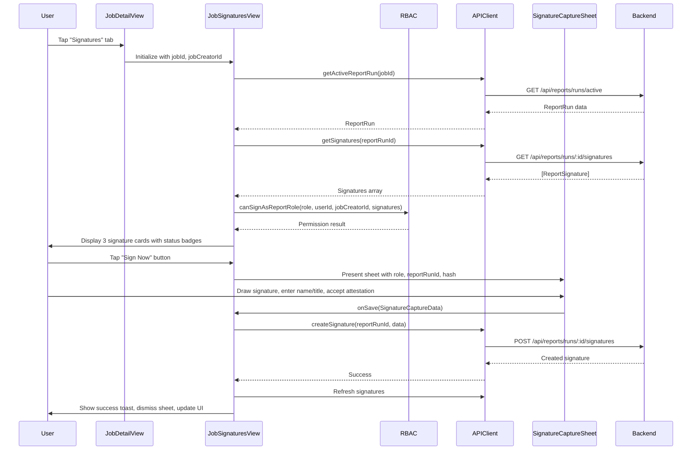

# iOS Signatures Tab — Architecture & Verification

> **Status:** ✅ Production-ready. The iOS Signatures Tab is fully implemented and integrated in the job detail view.

## Overview

The iOS Signatures Tab integration is **already fully implemented** in the codebase. `mobile/Riskmate/Riskmate/Views/Job/JobSignaturesView.swift` contains a complete implementation with all requested features, integrated into `mobile/Riskmate/Riskmate/Views/Main/JobDetailView.swift` as the "Signatures" tab. The implementation includes 3 signature cards, status badges, role-based permissions via RBAC, SVG rendering, and full integration with `mobile/Riskmate/Riskmate/Views/Signatures/SignatureCaptureSheet.swift`.

## Approach

The implementation follows a clean MVVM-like pattern with separation of concerns:

- **View layer:** `JobSignaturesView`
- **Data models:** `ReportRun`, `ReportSignature`, `SignatureRole`
- **API layer:** `APIClient`
- **Business logic:** `RBAC` for permissions

All components are production-ready with proper error handling, loading states, and user feedback.

---

## Implementation Status

### ✅ Core Implementation

#### 1. JobSignaturesView.swift (Lines 1-553)

**Location:** `mobile/Riskmate/Riskmate/Views/Job/JobSignaturesView.swift`

**Core Features:**
- Three signature cards for Prepared By, Reviewed By, and Approved By roles
- Status badges showing "Signed" (green) or "Pending" (gray) states
- "Sign Now" buttons that appear only for eligible users based on role permissions
- SVG signature rendering using WKWebView (`SignatureSvgView` at lines 522-544)
- Display of signer name, title, and relative timestamp (e.g., "Signed 2h ago")
- Report run banner showing status and generation date
- Export section that appears when all three signatures are complete
- Empty state with "Create report run" CTA
- Pull-to-refresh functionality
- Comprehensive error handling with retry mechanisms

**Role-Based Permissions (Lines 24-36):**
- Uses `RBAC` class from `mobile/Riskmate/Riskmate/Utils/RBAC.swift`
- Checks `canSignAsReportRole()` for each signature role
- Passes job creator ID for "Prepared By" validation
- Ensures reviewer cannot be the same person as preparer
- Restricts "Approved By" to admin/owner roles only

**State Management:**
- `@State` properties for active run, signatures, loading, errors
- Separate error states for run fetch vs. signatures fetch
- `SigningContext` for managing signature capture sheet presentation

#### 2. JobDetailView Integration (Line 238)

**Location:** `mobile/Riskmate/Riskmate/Views/Main/JobDetailView.swift`

```swift
case .signatures:
    JobSignaturesView(jobId: jobId, jobCreatorId: job.createdBy, onExportTapped: { showExportProofSheet = true })
```

- Tab appears in the tab bar alongside Overview, Hazards, Controls, Activity, and Evidence
- Passes `jobCreatorId` from the Job model for RBAC validation
- Provides `onExportTapped` callback to trigger Proof Pack export sheet

#### 3. SignatureCaptureSheet Integration (Lines 112-130)

- Presented via `.sheet(item: $signingContext)` modifier
- Passes report run ID, hash, and creation date for integrity verification
- Handles signature submission with `submitSignature()` method
- Shows success toast on completion
- Refreshes signatures list after successful save
- Dismisses automatically on success, stays open on error

---

## Data Layer

### Data Models (APIClient.swift lines 1053-1190)

**ReportRun** (lines 1053-1097):
- Properties: `id`, `jobId`, `organizationId`, `status`, `dataHash`, `generatedAt`, `packetType`, `pdfGeneratedAt`
- Custom decoder for ISO8601 date parsing with fractional seconds
- Snake_case to camelCase mapping via CodingKeys

**SignatureRole** (lines 1115-1129):
- Enum cases: `preparedBy`, `reviewedBy`, `approvedBy`, `other`
- `displayTitle` computed property for UI labels
- Raw values match API contract (e.g., "prepared_by")

**ReportSignature** (lines 1131-1190):
- Properties: `id`, `reportRunId`, `signerName`, `signerTitle`, `signatureRole`, `signatureSvg`, `signedAt`, `attestationText`, `signerUserId`
- Custom encoder/decoder for date handling
- `signerUserId` used for RBAC validation (reviewer ≠ preparer)

### API Client Methods (APIClient.swift)

| Method | Endpoint | Purpose |
|--------|----------|---------|
| `getActiveReportRun` | `GET /api/reports/runs/active` | Fetch or create signable report run |
| `getSignatures` | `GET /api/reports/runs/:id/signatures` | Fetch all signatures for a report run |
| `createSignature` | `POST /api/reports/runs/:id/signatures` | Submit a new signature (enforces RBAC on backend) |

---

## RBAC Implementation

**Location:** `mobile/Riskmate/Riskmate/Utils/RBAC.swift` (lines 124-194)

**canSignAsReportRole** method enforces:

| Role | Allowed For |
|------|-------------|
| **Prepared By** | Job creator (any role) OR admin/owner |
| **Reviewed By** | Any user except the preparer; Executive can review but not prepare/approve |
| **Approved By** | Admin or Owner only |

**Role Hierarchy:**
- Owner: all permissions
- Admin: all except some owner-specific actions
- Safety Lead: field work + review
- Member: field work + review (own jobs)
- Executive: view + review only
- Auditor: read-only (no signing)

---

## UI Components Used

| Component | Purpose |
|-----------|---------|
| `RMGlassCard` | Signature cards and report run banner |
| `RMEmptyState` | Shown when no report run exists |
| `RMTheme` | Typography, colors, spacing, radius |
| `ToastCenter` | Success feedback ("Signature saved", "New report run created") |
| `Haptics` | Tap and success feedback on interactions |

---

## Architecture Diagram



---

## Verification Checklist

| Requirement | Status | Location |
|-------------|--------|----------|
| Create JobSignaturesView.swift | ✅ Complete | `mobile/Riskmate/Riskmate/Views/Job/JobSignaturesView.swift` |
| 3 signature cards (Prepared By, Reviewed By, Approved By) | ✅ Complete | Lines 91-97 (ForEach loop) |
| Display signature status badges (Signed/Pending) | ✅ Complete | Lines 321-329 (statusBadge) |
| Show "Sign Now" buttons for eligible roles | ✅ Complete | Lines 299-316 (conditional button) |
| Render signed signatures (SVG) | ✅ Complete | Lines 333-339, 522-544 (SignatureSvgView) |
| Display signer name, title, timestamp | ✅ Complete | Lines 340-350 (signedContent) |
| Implement role-based permissions | ✅ Complete | Lines 24-36, RBAC.swift lines 139-193 |
| Add "Signatures" tab to JobDetailView | ✅ Complete | JobDetailView.swift line 238 |
| Integrate with SignatureCaptureSheet | ✅ Complete | Lines 112-130 (sheet modifier) |

---

## Additional Features Implemented

1. **Report Run Management:**
   - Display run status (draft, ready_for_signatures, final, complete)
   - "Manage runs" button to view/switch between runs
   - "Create new run" button when current run is non-signable
   - Run generation timestamp display

2. **Error Handling:**
   - Separate error states for run fetch vs. signatures fetch
   - Retry buttons for failed operations
   - Error banners with user-friendly messages
   - Graceful degradation when signatures fail to load

3. **User Experience:**
   - Pull-to-refresh support
   - Loading indicators during async operations
   - Empty state with clear CTA
   - Success toasts for completed actions
   - Haptic feedback on interactions
   - Relative timestamps (e.g., "Signed 2h ago")

4. **Export Integration:**
   - "Export Proof Pack" button when all signatures complete
   - Callback to parent view for export sheet presentation
   - Visual confirmation of completion status

5. **Data Integrity:**
   - Report run hash display in signature capture
   - Immutable run data guarantee
   - Attestation text capture and storage

---

## Testing Recommendations

### Permission Testing
- Test as different roles (Member, Safety Lead, Admin, Owner, Executive)
- Verify "Prepared By" restricted to job creator or admin/owner
- Verify "Reviewed By" blocked for the preparer
- Verify "Approved By" restricted to admin/owner only

### Workflow Testing
1. Create a new report run
2. Sign as Prepared By
3. Sign as Reviewed By (different user)
4. Sign as Approved By (admin/owner)
5. Verify export button appears after all signatures

### Error Scenarios
- Test with no network connection
- Test with invalid permissions
- Test signature capture cancellation
- Test duplicate signature attempts

### UI/UX Testing
- Verify SVG signatures render correctly
- Test pull-to-refresh
- Verify status badges update in real-time
- Test on different device sizes (iPhone SE, Pro Max, iPad)

---

## File Reference

### Core Implementation
- `mobile/Riskmate/Riskmate/Views/Job/JobSignaturesView.swift` — Main signatures tab view
- `mobile/Riskmate/Riskmate/Views/Main/JobDetailView.swift` — Tab integration (line 238)
- `mobile/Riskmate/Riskmate/Views/Signatures/SignatureCaptureSheet.swift` — Signature capture modal

### Data Layer
- `mobile/Riskmate/Riskmate/Services/APIClient.swift` — API methods (lines 811-879, 1053-1198)
- `mobile/Riskmate/Riskmate/Models/Job.swift` — Job model with createdBy field

### Business Logic
- `mobile/Riskmate/Riskmate/Utils/RBAC.swift` — Role-based access control (lines 139-193)
- `mobile/Riskmate/Riskmate/Services/EntitlementsManager.swift` — User entitlements

### UI Components
- `mobile/Riskmate/Riskmate/Views/Shared/RMGlassCard.swift` — Card component
- `mobile/Riskmate/Riskmate/Components/RMEmptyState.swift` — Empty state component

---

## Conclusion

The iOS Signatures Tab integration is **production-ready and fully functional**. All requirements have been implemented with additional features for robustness, error handling, and user experience. The implementation follows iOS best practices with proper state management, async/await patterns, and SwiftUI conventions. No further development work is required unless new requirements are identified.
