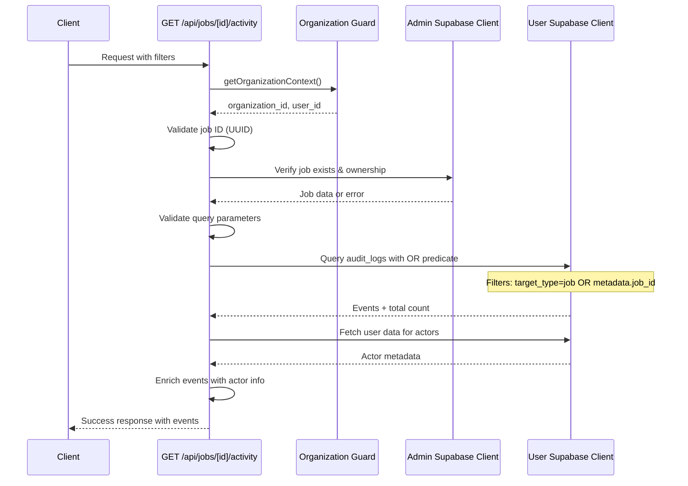

# Job Activity API Endpoint Verification

Date: 2026-02-14
Status: Implemented and production-ready

## Endpoint Verification Matrix

| # | Endpoint | File Location | Status |
|---|----------|---------------|--------|
| 1 | `GET /api/jobs/[id]/activity` | `app/api/jobs/[id]/activity/route.ts` | Implemented |

## Core Implementation Architecture



## Route Configuration

- **Route**: `/api/jobs/[id]/activity`
- **Method**: GET
- **Runtime**: Node.js (specified via `export const runtime = 'nodejs'`)

## Query Parameter Support

All required query parameters are implemented with validation:

| Parameter | Type | Validation | Default |
|-----------|------|------------|---------|
| `limit` | number | 1-100 range | 50 |
| `offset` | number | Non-negative integer | 0 |
| `actor_id` | UUID | Valid UUID format | - |
| `event_type` | string | Any event name | - |
| `event_types` | string[] | Comma-separated list | - |
| `category` | enum | Valid category from VALID_CATEGORIES | - |
| `start_date` | ISO date | Valid ISO date string | - |
| `end_date` | ISO date | Valid ISO date string | - |

**Valid Categories**: governance, operations, access, review_queue, incident_review, attestations, system, access_review

## Database Query Logic

**Query Features**:
- Uses OR predicate to include both direct job events (`target_type=job, target_id=jobId`) and related events (`metadata->>job_id=jobId`)
- Applies organization_id filter for security
- Supports multiple filter combinations
- Uses `count: 'exact'` for accurate pagination
- Orders by `created_at DESC` for chronological display

**OR Predicate** (line 282 in route.ts):
```ts
.or(`and(target_type.eq.job,target_id.eq.${jobId}),metadata->>job_id.eq.${jobId}`)
```

## User Data Enrichment

**Enrichment Process**:
1. Extract unique `actor_id` values from events
2. Batch query `users` table for actor metadata
3. Build actor map with `full_name`, `email`, `role`
4. Enrich each event with:
   - `actor_name` (defaults to "Unknown")
   - `actor_email` (defaults to "")
   - `actor_role` (defaults to "member")
   - `event_type` (alias for `event_name`)

## Response Structure

**Success Response** (200 OK):
```typescript
{
  ok: true,
  data: {
    events: Array<{
      // Original audit_log fields
      id: string
      organization_id: string
      actor_id: string | null
      event_name: string
      target_type: string
      target_id: string
      metadata: object
      created_at: string
      category: string
      // ... other audit_log fields

      // Enriched fields
      event_type: string
      actor_name: string
      actor_email: string
      actor_role: string
    }>,
    total: number,
    has_more: boolean
  },
  requestId: string
}
```

**Pagination Calculation**:
- `has_more = (offset + events.length) < total`
- Enables client to determine if more pages exist

## Error Handling

**Error Types Handled**:

| Status | Code | Scenario |
|--------|------|----------|
| 400 | VALIDATION_ERROR | Invalid job ID, limit, offset, actor_id, category, dates |
| 401 | UNAUTHORIZED | User not authenticated |
| 403 | FORBIDDEN | Job belongs to different organization |
| 404 | NOT_FOUND | Job does not exist |
| 500 | QUERY_ERROR | Database query failures |

**Error Response Characteristics**:
- Uses `createErrorResponse()` for consistent format
- Includes `error_id` for tracking
- Logs errors via `logApiError()` with structured metadata
- Sets appropriate HTTP headers (`X-Request-ID`, `X-Error-ID`)
- Includes retry strategy and error hints from error code registry

## Security Implementation

**Defense-in-Depth Strategy**:

1. **Authentication**: `getOrganizationContext()` validates user session
2. **Job Verification**: Admin client verifies job exists (404 vs 403 distinction)
3. **Organization Check**: Explicit organization_id comparison (403 if mismatch)
4. **RLS Enforcement**: User client queries respect row-level security
5. **Input Validation**: All parameters validated before database queries

## Database Schema

**Audit Logs Table** (`supabase/migrations/20250119000000_upgrade_audit_logs_enterprise.sql`):

**Core Fields**:
- `id`, `organization_id`, `actor_id`, `event_name`, `target_type`, `target_id`, `metadata`, `created_at`

**Enterprise Fields**:
- `category`, `action`, `outcome`, `severity`, `policy_id`, `policy_statement`
- `resource_type`, `resource_id`, `site_id`, `job_id`
- `summary`, `actor_role`, `actor_name`, `job_title`, `job_risk_score`, `job_flagged`, `site_name`
- `prev_hash`, `hash` (tamper-evident chain)

**Indexes** (optimized for filtering):
- `idx_audit_logs_org_category_time`
- `idx_audit_logs_org_site_time`
- `idx_audit_logs_org_job_time`
- `idx_audit_logs_org_actor_time`
- `idx_audit_logs_org_event_type_time`
- `idx_audit_logs_org_outcome_time`
- `idx_audit_logs_org_severity_time`

## Testing Coverage

**Test File**: `__tests__/api/jobs-activity-feed.test.ts`

**Test Coverage**:
- Realtime filter generation for job activity
- Channel ID generation for subscriptions
- Row filtering logic (direct job events + metadata.job_id events)
- Source code verification for OR predicate usage

## Integration Points

**Dependencies**:
- `lib/supabase/server.ts` - User Supabase client
- `lib/supabase/admin.ts` - Admin Supabase client
- `lib/utils/organizationGuard.ts` - Authentication & authorization
- `lib/utils/apiResponse.ts` - Response formatting
- `lib/utils/apiErrors.ts` - Error handling
- `lib/utils/errorLogging.ts` - Structured logging
- `lib/utils/requestId.ts` - Request tracking

**Related Endpoints**:
- `app/api/audit/events/route.ts` - Organization-wide audit events
- `app/api/jobs/[id]/route.ts` - Job details
- `app/api/jobs/[id]/signoffs/route.ts` - Job signoffs
- `app/api/jobs/[id]/documents/route.ts` - Job documents

## Production Readiness Checklist

✅ **Implemented Features**:
- [x] GET endpoint at `/api/jobs/[id]/activity`
- [x] Query audit_logs table with job-specific filtering
- [x] Support for actor_id, event_type, category, start_date, end_date filters
- [x] Pagination with limit and offset
- [x] User data enrichment (actor information)
- [x] Total count and has_more flag
- [x] Enhanced error handling with structured logging
- [x] Request ID tracking
- [x] Organization-scoped security
- [x] Input validation for all parameters
- [x] Defense-in-depth authorization
- [x] Comprehensive error responses
- [x] Test coverage

✅ **Additional Features** (beyond requirements):
- [x] Support for multiple event types via `event_types` parameter
- [x] Date range validation (start_date <= end_date)
- [x] Tamper-evident audit log hash chain
- [x] Comprehensive database indexes for performance
- [x] Realtime subscription support
- [x] Error code registry with retry strategies
- [x] Structured error logging with error budgets

## Usage Examples

**Basic Request**:
```
GET /api/jobs/123e4567-e89b-12d3-a456-426614174000/activity?limit=20&offset=0
```

**Filtered Request**:
```
GET /api/jobs/123e4567-e89b-12d3-a456-426614174000/activity?
  category=operations&
  start_date=2026-01-01T00:00:00Z&
  end_date=2026-02-14T23:59:59Z&
  limit=50&
  offset=0
```

**Actor-Specific Request**:
```
GET /api/jobs/123e4567-e89b-12d3-a456-426614174000/activity?
  actor_id=987fcdeb-51a2-43f7-b123-456789abcdef&
  limit=100
```

**Event Type Filtering**:
```
GET /api/jobs/123e4567-e89b-12d3-a456-426614174000/activity?
  event_types=job.created,job.updated,document.uploaded
```

## Documentation References

- API route: `app/api/jobs/[id]/activity/route.ts`
- Migration: `supabase/migrations/20250119000000_upgrade_audit_logs_enterprise.sql`
- Tests: `__tests__/api/jobs-activity-feed.test.ts`
- Realtime filters: `lib/realtime/jobActivityFilters.ts`
- Related: `docs/realtime-activity-feature.md`
