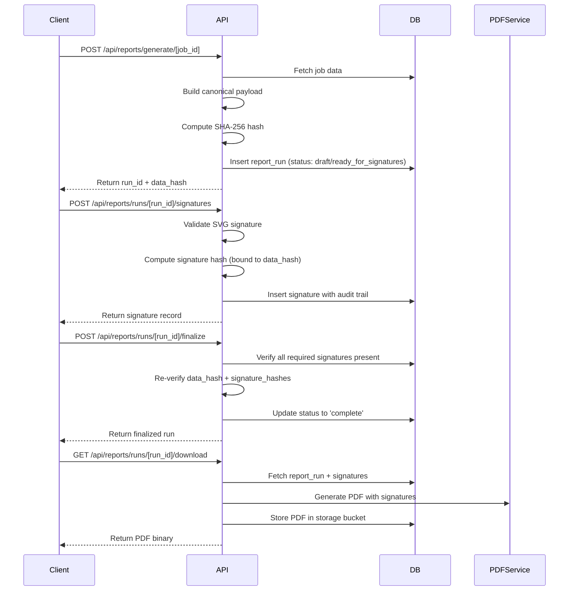
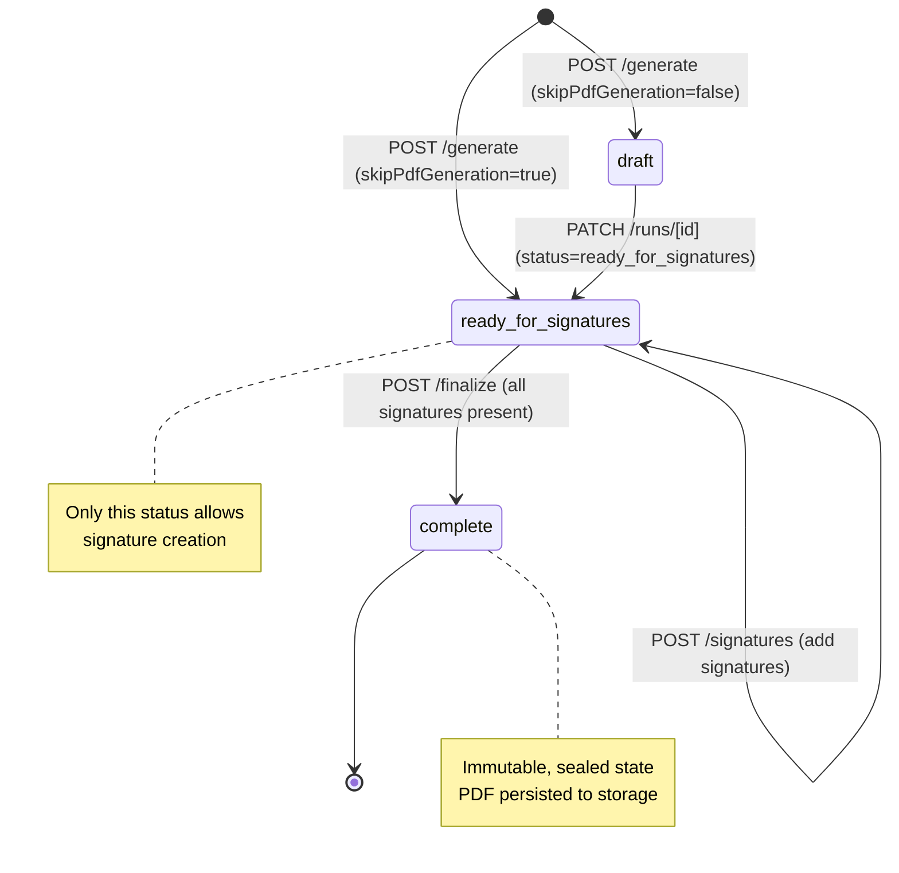

# Signature API Endpoint Verification

Date: 2026-02-14
Status: Implemented and production-ready

## Endpoint Verification Matrix

| # | Endpoint | File Location | Status |
|---|----------|---------------|--------|
| 1 | `POST /api/reports/generate/[job_id]` | `app/api/reports/generate/[job_id]/route.ts` | Implemented |
| 2 | `GET /api/reports/runs?job_id={id}` | `app/api/reports/runs/route.ts` (GET handler) | Implemented |
| 3 | `GET /api/reports/runs/[run_id]` | `app/api/reports/runs/[id]/route.ts` (GET handler) | Implemented |
| 4 | `GET /api/reports/runs/[run_id]/signatures` | `app/api/reports/runs/[id]/signatures/route.ts` (GET handler) | Implemented |
| 5 | `POST /api/reports/runs/[run_id]/signatures` | `app/api/reports/runs/[id]/signatures/route.ts` (POST handler) | Implemented |
| 6 | `POST /api/reports/runs/[run_id]/finalize` | `app/api/reports/runs/[id]/finalize/route.ts` | Implemented |
| 7 | `GET /api/reports/runs/[run_id]/download` | `app/api/reports/runs/[id]/download/route.ts` | Implemented |

## Core Implementation Architecture



## Key Endpoint Details

### 1) POST /api/reports/generate/[job_id]

- Builds canonical payload server-side (`buildJobPacket` or `buildJobReport`)
- Computes SHA-256 via `computeCanonicalHash` (`lib/utils/canonicalJson.ts`)
- Supports `skipPdfGeneration` for signature-ready runs
- Includes idempotency for same hash within 30 seconds
- Applies PDF rate limiting only to PDF generation path
- Supports packet types: `insurance`, `audit`, `incident`, `client_compliance`
- Returns `report_run_id`, `data_hash`, `status`, `generated_at`

Request body:

```ts
{
  packetType?: 'insurance' | 'audit' | 'incident' | 'client_compliance',
  skipPdfGeneration?: boolean
}
```

### 2) GET /api/reports/runs?job_id={id}

- Pagination: `limit` (default 10, max 100), `offset`
- Filters: `status`, `packet_type`
- Organization-scoped access
- Returns run list with pagination metadata

### 3) GET /api/reports/runs/[run_id]

- Returns single report run
- Enforces organization-scoped access
- Includes `data_hash`, `status`, `pdf_path`, and related fields

### 4) GET /api/reports/runs/[run_id]/signatures

- Returns non-revoked signatures only
- Includes audit fields (`ip_address`, `user_agent`, `signed_at`)
- Includes `attestation_text`
- Ordered by `signed_at` ascending

### 5) POST /api/reports/runs/[run_id]/signatures

- Validates SVG via `validateSignatureSvg` (`lib/utils/signatureValidation.ts`)
- Enforces one signature per required role (`prepared_by`, `reviewed_by`, `approved_by`)
- Allows multiple `other` signatures
- Computes tamper-evident hash via `computeSignatureHash` (`lib/utils/signatureHash.ts`)
- Binds signature to run `data_hash`
- Requires non-empty `attestation_text` and `attestationAccepted: true`
- Only accepts signing when run status is `ready_for_signatures`
- Captures audit trail (`ip_address`, `user_agent`)
- Supports admin signing on behalf of another user

Request body:

```ts
{
  signer_name: string,
  signer_title: string,
  signature_role: 'prepared_by' | 'reviewed_by' | 'approved_by' | 'other',
  signature_svg: string,
  attestation_text: string,
  attestationAccepted: boolean,
  signer_user_id?: string
}
```

Validation rules:

- Max SVG size: 100KB
- Requires at least one `<path>` or `<polyline>`
- Blocks dangerous content (`<script>`, `javascript:`, event handlers, `<iframe>`, `<object>`, `<embed>`)
- Disallows signing in `draft`, `complete`, `final`, or `superseded`

### 6) POST /api/reports/runs/[run_id]/finalize

- Requires status `ready_for_signatures`
- Requires all roles: `prepared_by`, `reviewed_by`, `approved_by`
- Rebuilds and verifies `data_hash`
- Verifies each `signature_hash`
- Restricts action to creator/admin
- Transitions to `complete` and sets `completed_at`

### 7) GET /api/reports/runs/[run_id]/download

- Fetches run and non-revoked signatures
- Uses cached PDF for `final`/`complete` when available
- Generates on-demand PDF for all runs
- Persists generated PDF for `final`/`complete`
- Uses signed print token and supports self-hosted PDF service or Browserless
- Returns PDF bytes with proper headers

## Database Schema

Source: `supabase/migrations/20251201000000_add_report_runs_and_signatures.sql`

`report_runs`:

- `id`, `organization_id`, `job_id`
- `status`: `draft`, `ready_for_signatures`, `complete`, `final`, `superseded`
- `packet_type`: `insurance`, `audit`, `incident`, `client_compliance`
- `generated_by`, `data_hash`
- `pdf_path`, `pdf_signed_url`, `pdf_generated_at`
- `completed_at`, `completed_hash`
- `generated_at`, `created_at`, `updated_at`

`report_signatures`:

- `id`, `organization_id`, `report_run_id`, `signer_user_id`
- `signer_name`, `signer_title`, `signature_role`
- `signature_svg`, `signature_hash`
- `attestation_text`, `signed_at`
- `ip_address`, `user_agent`
- `revoked_at`, `revoked_by`, `revoked_reason`

Constraints:

- Unique active role signature per run for required roles
- Immutability trigger for signature core fields

## Security and Integrity Features

- Data hash: `lib/utils/canonicalJson.ts` (`computeCanonicalHash`)
- Signature hash: `lib/utils/signatureHash.ts` (`computeSignatureHash`)
- Canonical JSON with deterministic ordering and normalization
- Signature binding inputs:
  `dataHash + reportRunId + signatureSvg + signerName + signerTitle + signatureRole + attestationText`
- SVG sanitization and strict validation
- Organization-scoped RLS policies

## Status Workflow



## Testing and Verification Steps

Manual API checks:

1. Create report run (`POST /api/reports/generate/[job_id]`)
2. List runs (`GET /api/reports/runs?job_id=[job_id]&status=ready_for_signatures`)
3. Get run (`GET /api/reports/runs/[run_id]`)
4. Add signature (`POST /api/reports/runs/[run_id]/signatures`)
5. List signatures (`GET /api/reports/runs/[run_id]/signatures`)
6. Finalize (`POST /api/reports/runs/[run_id]/finalize`)
7. Download PDF (`GET /api/reports/runs/[run_id]/download`)

Existing automated tests:

- `__tests__/pdf-signature-rendering.test.ts`
- `__tests__/pdf-signature-integration.test.ts`

Verification checklist:

- [ ] All 7 endpoints return expected responses
- [ ] SHA-256 hashes are computed correctly
- [ ] Signature validation rejects malicious SVG
- [ ] Status transitions enforce workflow rules
- [ ] RLS policies prevent unauthorized access
- [ ] Signature immutability is enforced
- [ ] PDF generation includes signatures
- [ ] Audit trail captures IP and user agent
- [ ] Finalization verifies all required signatures
- [ ] Hash verification detects tampering

## Documentation References

- API routes: `app/api/reports/`
- Utilities: `lib/utils/signatureHash.ts`, `lib/utils/signatureValidation.ts`, `lib/utils/canonicalJson.ts`
- Database: `supabase/migrations/20251201000000_add_report_runs_and_signatures.sql`
- PDF signatures: `lib/utils/pdf/sections/signatures.ts`
- Rendering guide: `docs/pdf-signature-rendering.md`

## Environment Configuration

Option 1 (self-hosted PDF service):

- `PDF_SERVICE_URL`
- `PDF_SERVICE_SECRET`

Option 2 (Browserless):

- `BROWSERLESS_TOKEN`

Storage:

- Supabase storage bucket `reports`

## Production Readiness Summary

- Comprehensive error handling
- Request ID tracking
- PDF generation rate limiting
- Idempotent report run creation
- Audit logging
- Security validation
- Multi-tenant isolation
- Cached PDF fallback path
