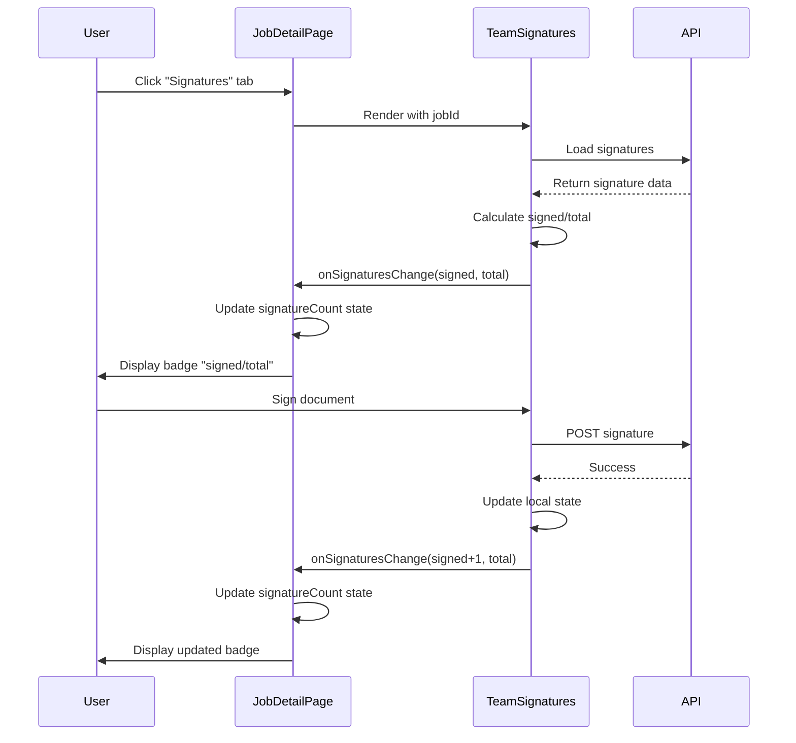

# Web Signatures Tab — Verification & Integration Documentation

> **Status:** ✅ Production-ready. The Web Signatures Tab is fully implemented in the job detail page.

## Overview

The Web Signatures Tab integration has been fully implemented at `app/operations/jobs/[id]/page.tsx`. This document captures the verification checklist, integration details, and badge update flow for future reference.

---

## Integration Checklist

| Component | Status | Location |
|-----------|--------|----------|
| Tab Navigation | ✅ Complete | Lines 862-890 |
| Signatures Tab Button | ✅ Complete | Lines 878-889 |
| Signature Count Badge | ✅ Complete | Lines 884-888 |
| TeamSignatures Import | ✅ Complete | Line 25 |
| TeamSignatures Render | ✅ Complete | Lines 908-922 |
| State Management | ✅ Complete | Lines 164, 166 |
| Callback Integration | ✅ Complete | Lines 917-919 |
| GlassCard Wrapper | ✅ Complete | Lines 909-922 |

---

## Implementation Details

### 1. Tab Navigation

- **Location:** Lines 862-890
- Three tabs: Overview, Activity, Signatures
- Uses `tabStyles` from design system (`@/lib/styles/design-system`)
- Active/inactive states applied via `tabStyles.active` and `tabStyles.inactive`

### 2. TeamSignatures Component

- **Location:** Lines 908-922
- **Import:** `@/components/report/TeamSignatures` (line 25)
- **Props:**
  - `jobId={jobId}` — passes current job ID
  - `readOnly={false}` — enables editing
  - `onReportRunCreated` — initializes signature count to `{ signed: 0, total: 3 }`
  - `onSignaturesChange` — updates badge count in real time

### 3. Signature Count Badge

- **Location:** Lines 884-888
- **Format:** `{signed}/{total}` (e.g., "0/3", "2/3", "3/3")
- **Conditional:** Renders only when `signatureCount !== null`
- **Styling:** `ml-1.5 inline-flex items-center justify-center min-w-[2rem] px-1.5 py-0.5 text-xs font-medium rounded-md bg-white/10 text-white/80 border border-white/10`

### 4. State Management

- **Location:** Lines 164, 166
- `activeTab`: `'overview' | 'activity' | 'signatures'`, default `'overview'`
- `signatureCount`: `{ signed: number; total: number } | null`

### 5. Initial Badge Load

- **Location:** Lines 392-421
- `useEffect` fetches report runs and signatures on page load
- Sets `signatureCount` so the tab badge displays without requiring the user to open the Signatures tab first

---

## Badge Update Flow

---

## UI/UX Verification

### Tab Appearance

- Design system `tabStyles` for consistency
- Active tab: orange color (`#F97316`) with bottom border
- Inactive tabs: white/60 opacity with hover effect
- Badge: inline-flex, white/10 background, rounded corners

### Badge Format

- Text: `{signed}/{total}` (e.g., "0/3", "2/3", "3/3")
- Conditional: Only when `signatureCount !== null`
- Layout: Inside `GlassCard` with `p-6 md:p-8`

---

## Edge Cases to Test

| Scenario | Expected Behavior |
|----------|-------------------|
| No Signatures Yet | Badge shows "0/3" |
| Partial Signatures | Badge shows "1/3" or "2/3" |
| All Signatures Complete | Badge shows "3/3" |
| Report Run Creation | Badge initializes to "0/3" via `onReportRunCreated` |
| Real-time Updates | Badge updates immediately after signing |
| Tab Switching | Badge persists when switching between tabs |
| Page Refresh | Signature count loads from API on mount |

---

## Best Practices (Documentation Notes)

- **Separation of Concerns:** TeamSignatures manages signature logic; JobDetailPage manages tab state.
- **Callback Pattern:** Uses `onSignaturesChange` for parent-child communication.
- **Type Safety:** TypeScript types for state and props.
- **Design System:** Consistent styling using `tabStyles` and `GlassCard`.
- **Accessibility:** Semantic HTML with button elements for tabs.
- **Performance:** Conditional rendering prevents unnecessary re-renders.

---

*Last verified: February 2025*
