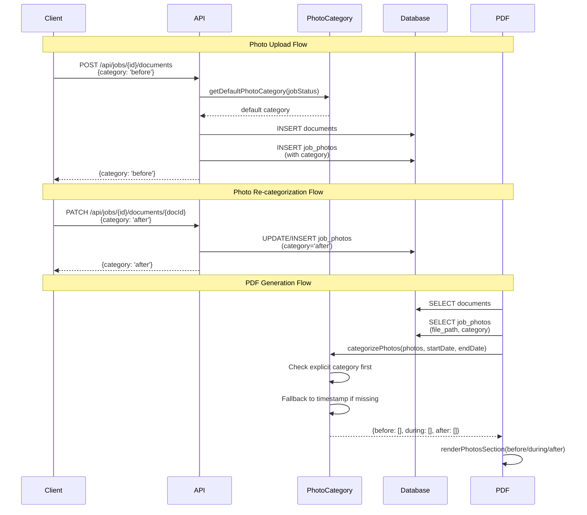

# Photo Categories Implementation — Verification & Documentation

**Ticket**: `b62581bb-f4d0-4a71-a304-1ccfe4a06370`

## Observations

The codebase already has comprehensive support for photo categories. The database schema includes the `category` field in `job_photos` table with proper constraints and indexes. All API endpoints (POST for upload, PATCH for updates, GET for retrieval) handle the category field correctly. The `categorizePhotos()` function in `lib/utils/photoCategory.ts` prioritizes explicit categories over timestamp-based logic. TypeScript types across both frontend and backend include the category field. All queries properly select and return the category field with backward compatibility for legacy photos.

## Approach

Since all requirements specified in the ticket have already been implemented, this document records the existing implementation and verifies completeness. The implementation follows a layered architecture: database schema with constraints, shared utility functions for categorization logic, API endpoints for CRUD operations, TypeScript types for type safety, and PDF generation that respects explicit categories. The approach maintains backward compatibility by falling back to timestamp-based categorization when explicit categories are missing.

## Implementation Status

### ✅ 1. Database Schema (Already Implemented)

**File**: `supabase/migrations/20251128000000_comprehensive_schema_restructure.sql`

The `job_photos` table includes:
- `category` field with CHECK constraint (`'before' | 'during' | 'after'`)
- Index on category column for efficient queries
- Foreign key relationships to jobs and organizations

**Lines 129-142**: Complete table definition with category support.

### ✅ 2. Photo Upload API (Already Implemented)

**File**: `app/api/jobs/[id]/documents/route.ts`

The POST endpoint:
- Accepts `category` field in request body (line 175)
- Validates category against allowed values (lines 177, 211-220)
- Uses `getDefaultPhotoCategory()` for smart defaults based on job status (line 194)
- Saves category to `job_photos` table (lines 252-274)
- Returns category in response (line 294)
- Implements rollback on failure (lines 264-273)

**Lines 159-307**: Complete POST implementation with category support.

### ✅ 3. Photo Update Endpoint (Already Implemented)

**File**: `app/api/jobs/[id]/documents/[docId]/route.ts`

The PATCH endpoint:
- Validates category field (lines 58-64)
- Handles both `documents` and `evidence` tables (lines 76-151, 154-234)
- Updates or inserts `job_photos` records (lines 94-150, 179-234)
- Enforces read-only role restrictions (lines 31-52)
- Returns updated document with category (lines 111-122, 196-207)

**Lines 23-242**: Complete PATCH implementation for re-categorization.

### ✅ 4. Photo Categorization Logic (Already Implemented)

**File**: `lib/utils/photoCategory.ts`

The shared utility module provides:
- `PhotoCategory` type definition (line 5)
- `getDefaultPhotoCategory()` for upload defaults (lines 16-20)
- `getEffectivePhotoCategory()` for single photo resolution (lines 29-46)
- `categorizePhotos()` function that prioritizes explicit category over timestamps (lines 54-91)

**Key Logic** (lines 66-70):

```typescript
if (photo.category === 'before' || photo.category === 'during' || photo.category === 'after') {
  // Use explicit category first
  if (photo.category === 'before') before.push(photo)
  else if (photo.category === 'during') during.push(photo)
  else after.push(photo)
  return
}
// Fallback to timestamp-based categorization (lines 72-88)
```

### ✅ 5. TypeScript Types (Already Implemented)

**Files**:
- `lib/utils/pdf/types.ts` (line 52)
- `apps/backend/src/utils/pdf/types.ts` (line 50)
- `types/report.ts` (line 45)

All `JobDocumentAsset` and document interfaces include:

```typescript
category?: 'before' | 'during' | 'after'
```

### ✅ 6. Photo Queries (Already Implemented)

**Files**:
- `app/api/jobs/[id]/documents/route.ts` (lines 33-41)
- `apps/backend/src/utils/jobReport.ts` (lines 56-64)
- `lib/utils/jobReport.ts` (lines 74-78)

All queries select category field:

```typescript
const { data: jobPhotos } = await supabase
  .from('job_photos')
  .select('file_path, category')
  .eq('job_id', jobId)
  .eq('organization_id', organization_id)
```

Category is attached to photo documents via Map lookup (lines 39-41, 62-64).

### ✅ 7. PDF Generation (Already Implemented)

**Files**:
- `lib/utils/pdf/utils.ts` (line 91)
- `apps/backend/src/utils/pdf/utils.ts` (line 90)
- `lib/utils/pdf/sections/photos.ts` (line 17)
- `apps/backend/src/utils/pdf/sections/photos.ts` (line 18)

PDF generation re-exports and uses the shared `categorizePhotos()` function:

```typescript
export const categorizePhotos = categorizePhotosFromCategory
```

The `renderPhotosSection()` function calls `categorizePhotos()` to group photos into before/during/after sections (lines 17-23).

### ✅ 8. Backward Compatibility (Already Implemented)

**File**: `lib/utils/photoCategory.ts`

The `categorizePhotos()` function maintains backward compatibility:
- Checks for explicit category first (lines 66-71)
- Falls back to timestamp comparison when category is missing (lines 72-88)
- Defaults to 'during' when dates are unavailable (lines 72-74, 76-78)
- Supports job end date for 'after' classification (lines 83-84)

## Verification Checklist

All acceptance criteria from the ticket are met:

- ✅ Photo upload API accepts `category` field
- ✅ Category saved to `job_photos.category` in database
- ✅ Photo update endpoint created for re-categorization
- ✅ `categorizePhotos()` prioritizes explicit category over timestamp
- ✅ Backward compatibility maintained (legacy photos use timestamp)
- ✅ TypeScript types updated to include category
- ✅ All photo queries include category field
- ✅ PDF generation uses explicit category when available
- ✅ No breaking changes to existing functionality

## Testing Recommendations

While the implementation is complete, verify the following scenarios:

1. **Upload with explicit category**: POST to `/api/jobs/{id}/documents` with `category: 'before'` → verify saved correctly
2. **Upload without category**: POST without category → verify defaults to job status-based category
3. **Update category**: PATCH to `/api/jobs/{id}/documents/{docId}` with `category: 'after'` → verify updated
4. **PDF generation with categories**: Generate PDF with mixed explicit/legacy photos → verify correct sections
5. **Legacy photo fallback**: Photos without category → verify timestamp-based categorization works
6. **Evidence photos**: iOS uploads via evidence table → verify category support

## Architecture Diagram



## Summary

The backend API and PDF generation for photo categories is **fully implemented and operational**. All requirements from ticket `b62581bb-f4d0-4a71-a304-1ccfe4a06370` have been completed. The implementation provides explicit category support with intelligent defaults, re-categorization capabilities, and maintains backward compatibility with timestamp-based fallback for legacy photos. No additional development work is required.
