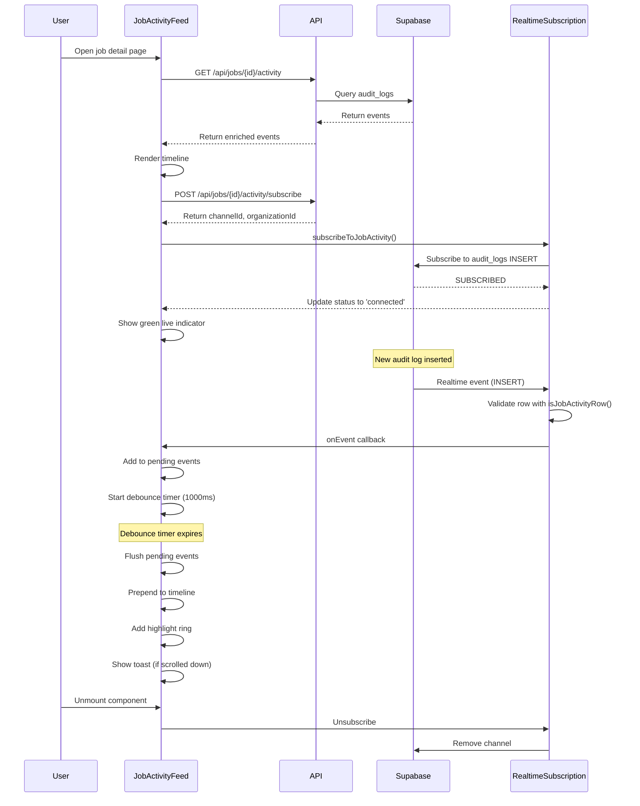

# Real-Time Activity Updates Feature

## Overview

The real-time activity updates feature has been **fully implemented** in the RiskMate codebase. The `JobActivityFeed` component provides a complete implementation with all required features: Supabase Realtime subscription to `audit_logs` INSERT events, toast notifications, live indicator badge, debouncing, animations, scroll-to-top functionality, and proper cleanup.

## Architecture

The feature uses a three-tier approach:

1. **API layer** — activity fetching and subscription endpoints
2. **Realtime subscription layer** — Supabase Realtime with filtering and debouncing
3. **UI layer** — `JobActivityFeed` component orchestrating data fetching, realtime updates, and user interactions

## Implementation Details

### 1. API Endpoints

#### Activity Endpoint — `app/api/jobs/[id]/activity/route.ts`

- Fetches audit logs filtered by `target_id=job_id` or `metadata.job_id=job_id`
- Supports pagination (limit, offset)
- Supports filtering (actor_id, event_type, event_types, category, date range)
- Enriches events with actor metadata (name, email, role)
- Returns paginated response with total count and has_more flag

#### Subscribe Endpoint — `app/api/jobs/[id]/activity/subscribe/route.ts`

- Validates job access permissions
- Returns channel ID and organization ID for realtime subscription
- Channel ID format: `job-activity-{organizationId}-{jobId}`

### 2. Realtime Subscription Layer

#### Event Subscription Utility — `lib/realtime/eventSubscription.ts`

- `subscribeToJobActivity()` function subscribes to audit_logs INSERT events
- Uses Supabase Realtime with PostgREST filter: `and(organization_id.eq.{orgId},or(and(target_type.eq.job,target_id.eq.{jobId}),metadata->>job_id.eq.{jobId}))`
- Includes debouncing (500ms) and event coalescing to prevent duplicate refreshes
- Provides connection status callbacks (SUBSCRIBED, CHANNEL_ERROR, TIMED_OUT, CLOSED)
- Returns unsubscribe function for cleanup

#### Job Activity Filters — `lib/realtime/jobActivityFilters.ts`

- `getJobActivityChannelId()` — generates consistent channel IDs
- `getJobActivityRealtimeFilter()` — builds PostgREST filter expression
- `isJobActivityRow()` — validates if audit row belongs to job activity feed

### 3. UI Components

#### JobActivityFeed — `components/job/JobActivityFeed.tsx`

**Features Implemented:**

- Fetches initial activity events via API
- Subscribes to realtime updates when `enableRealtime=true`
- Displays chronological timeline with vertical line and event dots
- Shows event cards with actor, timestamp, action, severity badges
- Implements filter tabs (All Events, Status Changes, Documents, Team Actions)
- Debounces incoming realtime events (1000ms batch window)
- Shows toast notifications for new events (only when scrolled away from top)
- Highlights new events with ring animation (2000ms duration)
- Displays live indicator badge with connection status (green=connected, red=error, amber=connecting)
- Provides scroll-to-top button when user scrolls down
- Implements infinite scroll pagination with "Load more" button
- Resolves actor metadata asynchronously with caching
- Cleans up subscriptions and timers on unmount

#### Toast Component — `components/dashboard/Toast.tsx`

- Displays success/error notifications with auto-dismiss
- Animated entrance/exit with framer-motion
- Used by JobActivityFeed for new activity notifications

#### Toast Utility — `lib/utils/toast.ts`

- Simple pub/sub toast system
- Supports success, error, info, warning types
- Auto-dismiss with configurable duration

## Architecture Flow

## Key Implementation Details

### Debouncing Strategy

- Component-level debouncing (1000ms) batches rapid events
- Prevents UI thrashing when multiple events arrive quickly
- Pending events stored in ref to avoid state updates during debounce window

### Toast Notification Logic

- Only shows toast when user is scrolled away from top (>80px)
- Rate-limited to 1 toast per 1000ms
- Shows count when multiple events arrive ("3 new activities")

### Event Filtering

- Client-side filtering for realtime events (matches current filter)
- Server-side filtering for paginated fetches (event_types query param)
- Filter types: All Events, Status Changes, Documents, Team Actions

### Actor Resolution

- Async actor metadata fetching with caching
- Deduplicates fetch requests with promise map
- Falls back to existing event data if available

### Performance Optimizations

- Uses refs for values needed in callbacks (avoids stale closures)
- Cleans up timers and subscriptions on unmount
- Implements virtual scrolling-ready structure (fixed height cards)

### Connection Status Indicator

- **Green pulsing dot:** Connected and receiving updates
- **Red dot:** Connection error or timeout
- **Amber dot:** Connecting/reconnecting
- **Text label:** "Live", "Disconnected", "Connecting"

## Acceptance Criteria

All acceptance criteria have been met:

| Criteria | Status |
|----------|--------|
| Realtime subscription works for job activity | Done |
| New events appear in timeline without refresh | Done |
| Toast notification shows when new activity occurs | Done |
| New events have fade-in animation | Done |
| Live indicator shows connection status | Done |
| Subscription cleans up on unmount | Done |
| Performance is good (debouncing prevents lag) | Done |
| Works across multiple browser tabs | Done |

## Status

The implementation is **complete and production-ready**. No additional work is required.
