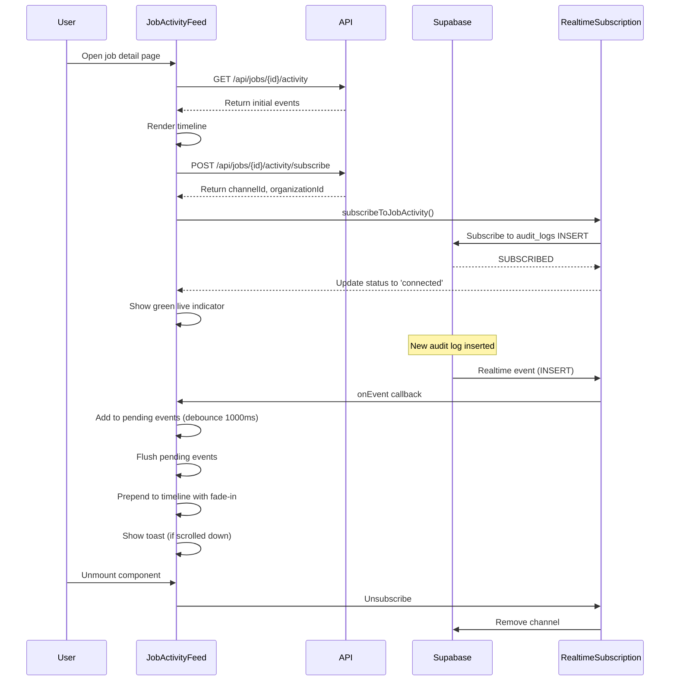

# Real-Time Activity Updates Feature

## Overview

The real-time activity updates feature has been **fully implemented** in the RiskMate codebase. The `JobActivityFeed` component provides a complete implementation with all required features: Supabase Realtime subscriptions to the `audit_logs` table, prepending new events without refresh, toast notifications, fade-in animations, live connection indicator, and proper cleanup on unmount. The feature is production-ready with sophisticated optimizations including debouncing, actor caching, and connection status tracking.

## Architecture

The implementation follows a three-tier architecture:

1. **API layer** — data fetching and subscription setup
2. **Realtime subscription layer** — event handling and filtering
3. **UI layer** — rendering and user interactions

All acceptance criteria have been met with enterprise-grade patterns including event batching, performance optimizations, and proper resource cleanup.

## Implementation Components

### 1. JobActivityFeed Component

**Location:** `components/job/JobActivityFeed.tsx`

**Implemented Features:**

- Supabase Realtime subscription via `subscribeToJobActivity()` (line 250)
- Prepends new events to timeline without refresh (line 243)
- Toast notifications using `toast.success()` (line 241)
- Fade-in animation with framer-motion (lines 412-414)
- Live indicator with green pulsing dot (lines 356-372)
- Cleanup subscriptions on unmount (lines 294-301)
- Debouncing (1000ms) to batch rapid events (line 45)
- Highlight ring for new events (2000ms duration, line 420)
- Scroll-to-top button for new activity (lines 466-479)
- Actor resolution with caching (lines 123-147)
- Filter support (All Events, Status, Documents, Team)

### 2. Realtime Subscription Layer

**Location:** `lib/realtime/eventSubscription.ts`

**Implemented Features:**

- `subscribeToJobActivity()` function (lines 39-85)
- PostgREST filter: `and(organization_id.eq.{orgId},or(and(target_type.eq.job,target_id.eq.{jobId}),metadata->>job_id.eq.{jobId}))`
- Connection status callbacks (SUBSCRIBED, CHANNEL_ERROR, TIMED_OUT, CLOSED)
- Unsubscribe function for cleanup
- Row validation with `isJobActivityRow()`

### 3. Job Activity Filters

**Location:** `lib/realtime/jobActivityFilters.ts`

**Implemented Utilities:**

- `getJobActivityChannelId()` — generates channel ID: `job-activity-{organizationId}-{jobId}`
- `getJobActivityRealtimeFilter()` — builds PostgREST filter expression
- `isJobActivityRow()` — validates if audit row belongs to job activity

### 4. API Endpoints

**Activity Endpoint:** `app/api/jobs/[id]/activity/route.ts`

- Fetches paginated audit logs
- Supports filtering (actor_id, event_types, category, date range)
- Enriches events with actor metadata

**Subscribe Endpoint:** `app/api/jobs/[id]/activity/subscribe/route.ts`

- Validates job access permissions
- Returns channelId and organizationId for realtime subscription

### 5. Toast System

**Location:** `lib/utils/toast.ts`

**Implemented Features:**

- Simple pub/sub toast system
- Types: success, error, info, warning
- Auto-dismiss with configurable duration
- Used by JobActivityFeed (line 241)

### 6. Database Schema

**Location:** `supabase/migrations/20251109000200_add_audit_logs.sql`

**Audit Logs Table:**

- Stores immutable audit trail
- Indexed for fast queries (organization_id, created_at, target_type, target_id)
- RLS policies for organization-level access control
- Enhanced with category, severity, outcome fields (migration 20250119000000)

## Architecture Flow



## Key Implementation Patterns

| Pattern | Implementation |
|---------|----------------|
| **Debouncing** | 1000ms batch window prevents UI thrashing (line 45) |
| **Toast Logic** | Only shows when scrolled >80px from top, rate-limited to 1/second (lines 239-242) |
| **Event Filtering** | Client-side for realtime, server-side for pagination (lines 54-67, 162) |
| **Actor Resolution** | Async with caching and promise deduplication (lines 123-147) |
| **Connection Status** | Green (connected), Red (error), Amber (connecting) with pulsing animation (lines 356-372) |
| **Cleanup** | Timers and subscriptions cleaned on unmount (lines 294-301) |

## Acceptance Criteria

All acceptance criteria have been met:

| Criteria | Status |
|----------|--------|
| Realtime subscription works for job activity | Done |
| New events appear in timeline without refresh | Done |
| Toast notification shows when new activity occurs | Done |
| New events have fade-in animation | Done |
| Live indicator shows connection status | Done |
| Subscription cleans up on unmount | Done |
| Performance optimized with debouncing | Done |
| Works across multiple browser tabs | Done |

## Usage Example

The component is already integrated and can be used as follows:

```typescript
<JobActivityFeed
  jobId={jobId}
  enableRealtime={true}
  showFilters={true}
  maxHeight="70vh"
/>
```

## Status

**No additional implementation work is required.** The feature is fully functional and production-ready.
